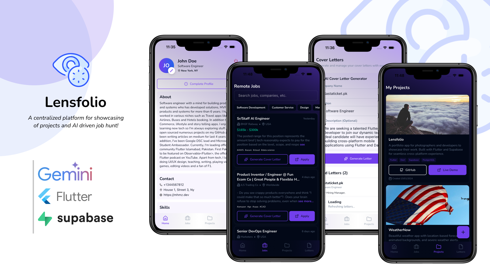
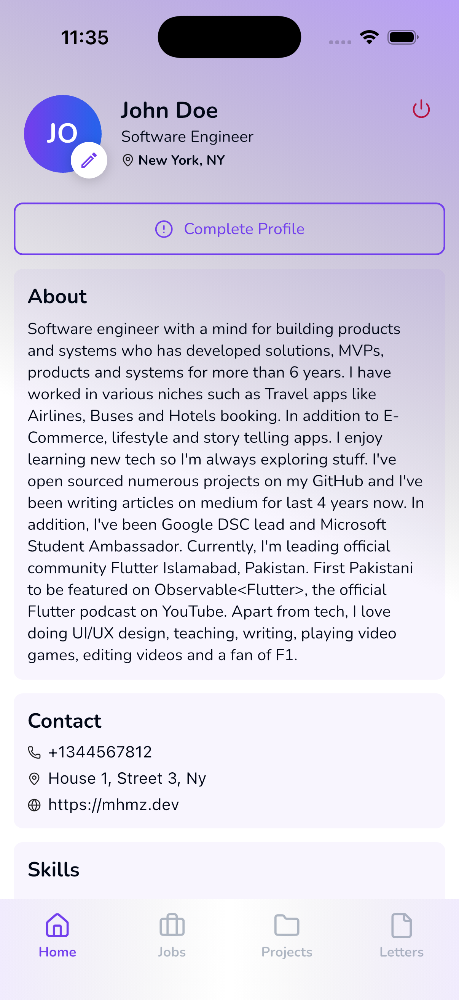
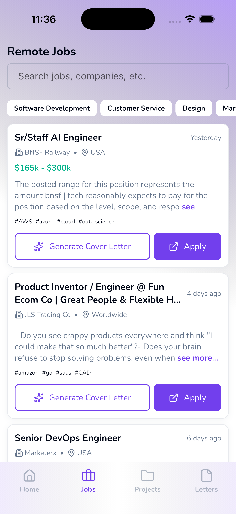
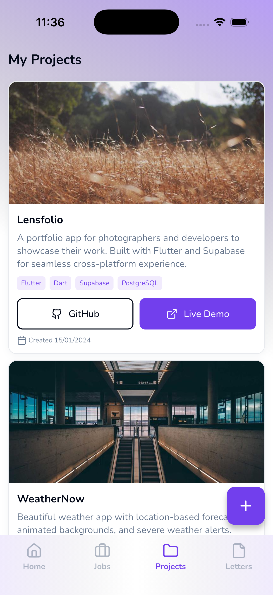
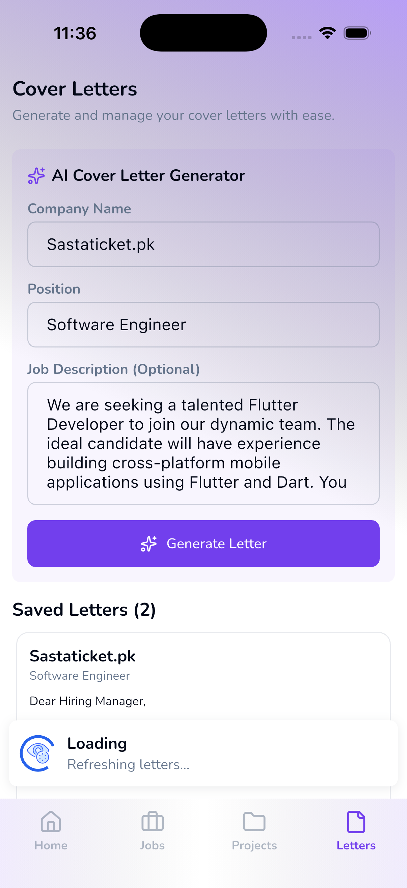
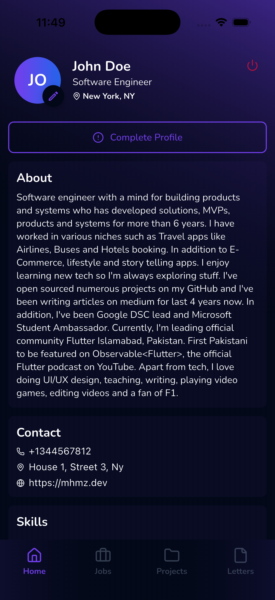
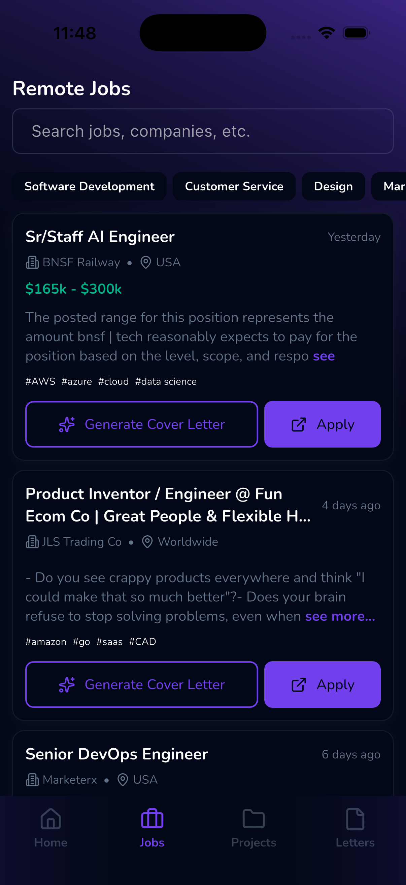
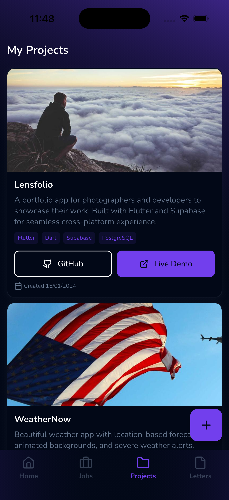
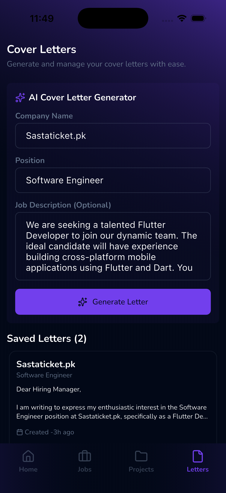

# Lensfolio Mobile App - Built at [flutterkaro](https://flutterkaro.mhmz.dev)

A Flutter mobile application built with clean architecture, layer-first structure, and best practices.



## 👀 Look'n Feel
This is a little glimpse of Lensfolio:

### ☀️ Light Theme
 
 

### 🌑 Dark Theme
 
 

## 🚀 Getting Started

### Prerequisites

- Flutter SDK (3.38.2 or higher)
- Dart SDK (3.10.0 or higher)
- Node.js (for Hygen code generation)
- CocoaPods (for iOS development)

### Installation

1. **Clone the repository:**
```bash
git clone <repository-url>
cd lensfolio_mobile_app
```

2. **Install dependencies:**
```bash
flutter pub get
```

3. **Install Hygen globally** (for code generation):
```bash
npm install -g hygen
```

4. **Run the app:**

**Option 1: From VS Code/Cursor**
- Open Debug panel (Cmd/Ctrl + Shift + D)
- Select your desired configuration
- Click Run

**Option 2: From Terminal**
```bash
flutter run
```

---

## 🏗️ Architecture

This project follows a **modified MVVM architecture** with layer-first organization.

For detailed architecture documentation, see [Architecture.md](Architecture.md)

**Quick Overview:**
- **Layer-First Structure**: Code organized by technical layer (blocs, repos, models, ui)
- **Single Source of Truth**: Cubit holds all app-level state
- **Two-Layer State**: Cubit (app-level) + Provider (ephemeral UI)
- **Unidirectional Data Flow**: View → ViewModel → Model → ViewModel → View
- **Clean Separation**: UI, Business Logic, Data layers are clearly separated

---

## ⚡ Code Generation

This project uses **Hygen** for boilerplate code generation. Templates are located in `_templates/`.

### Detailed Documentation

For comprehensive guides, see:
- [Cubit Nested Template](_templates/cubit/nested/README.md) - Complex cubits with multiple operations
- [Cubit Simple Template](_templates/cubit/simple/README.md) - Simple cubits for basic operations
- [Cubit Update Template](_templates/cubit/update/README.md) - Update existing cubits with new operations
- [Screen Template](_templates/screen/README.md) - Screen generation guide

---

## 🤝 Contributing

For development workflow, coding conventions, and contribution guidelines, see [CONTRIBUTING.md](CONTRIBUTING.md)

## ⭐️ Star History

[](https://www.star-history.com/#mhmzdev/lensfolio_mobile_app&Date)

## 🔑 License
- This project is licensed under the MIT License - see the [LICENSE](LICENSE.md) file for details

## 🧑 Author

#### Muhammad Hamza
[](https://www.linkedin.com/in/mhmzdev)

You can also follow my GitHub Profile to stay updated about my latest projects:

[](https://github.com/mhmzdev)

If you liked the repo then kindly support it by giving it a star ⭐!

Copyright (c) 2026 MUHAMMAD HAMZA
